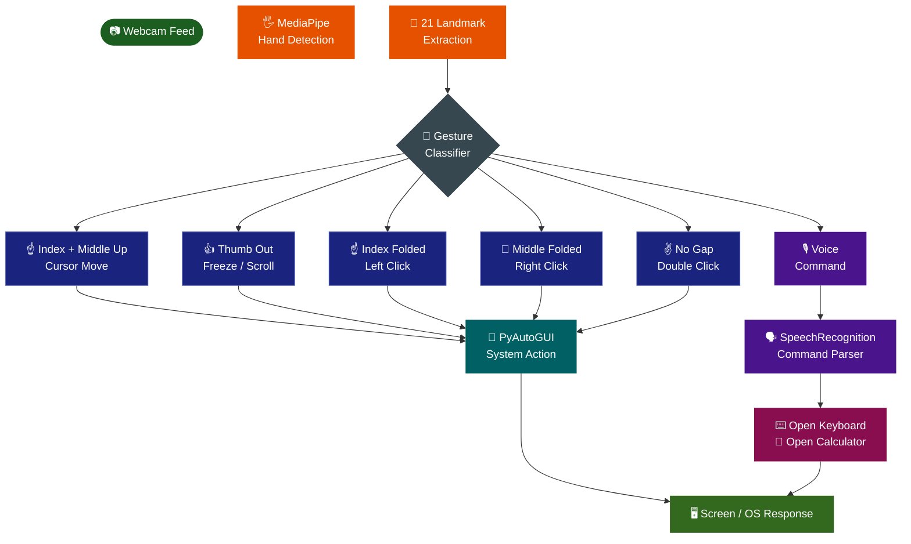
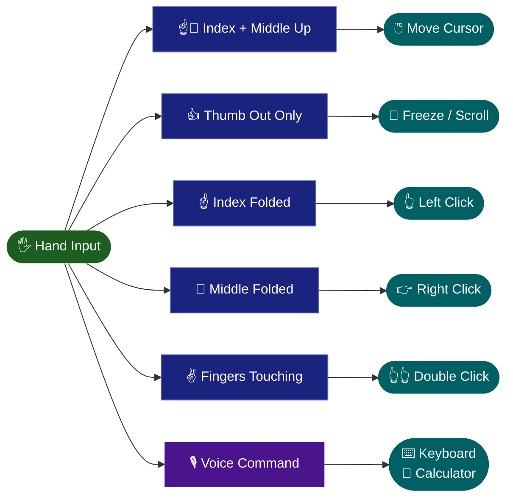
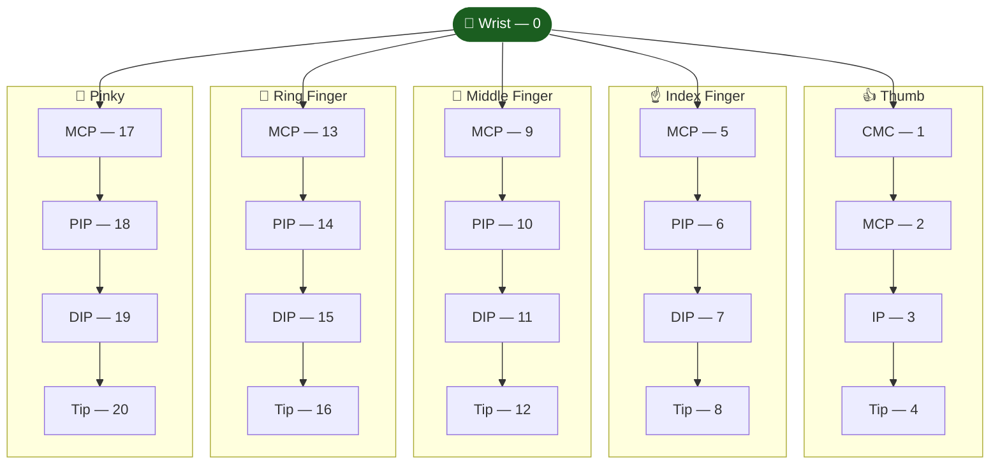

<div align="center">


[](https://git.io/typing-svg)

<br/>

[](https://python.org)
[](https://mediapipe.dev)
[](https://opencv.org)
[](https://pyautogui.readthedocs.io)
[](https://pypi.org/project/SpeechRecognition)

> *Control your computer with just your hand — no mouse required* 🖐️

</div>

---

## 📋 Table of Contents

<div align="center">

| | | |
|:---:|:---:|:---:|
| [✨ Features](#-features) | [🔄 System Flow](#-system-flow) | [🤚 Gesture Map](#-gesture-map) |
| [🦾 How It Works](#-how-it-works) | [📐 MediaPipe Landmarks](#-mediapipe-hand-landmarks) | [🛠️ Tech Stack](#%EF%B8%8F-tech-stack) |
| [📁 Project Structure](#-project-structure) | [🚀 Installation](#-installation) | [⚠️ Important Note](#%EF%B8%8F-important-note) |
| [👥 Collaborators](#-collaborators) | | |

</div>

---

## ✨ Features

<div align="center">

| Category | Gesture | Action |
|:---:|:---:|:---|
| 🖱️ **Cursor** | Index + Middle up | Move cursor smoothly |
| 🧊 **Freeze** | Thumb out | Stop cursor movement |
| 👆 **Left Click** | Index finger folded | Left mouse click |
| 👉 **Right Click** | Middle finger folded | Right mouse click |
| 👆👆 **Double Click** | No gap between Index & Middle | Double click |
| 📜 **Scroll** | Only thumb out + move hand | Scroll up / down |
| 🎙️ **Voice** | Say "Keyboard" or "Calculator" | Open system apps |

</div>

---

## 🔄 System Flow



---

## 🤚 Gesture Map



---

## 🦾 How It Works

MediaPipe detects **21 hand landmarks** in real time from the webcam feed. GestureX analyzes these points to determine:

<div align="center">

| Signal | What GestureX Detects |
|:---:|:---|
| 👆 Finger State | Which fingers are **up or folded** |
| 📏 Finger Gap | **Distance** between index and middle finger |
| 👍 Thumb Orientation | Thumb **direction and extension** |
| 🏃 Hand Motion | Overall **movement direction** for scrolling |

</div>

These signals are mapped to system actions using **PyAutoGUI**, and voice commands are handled by **SpeechRecognition** running on a background thread.

---

## 📐 MediaPipe Hand Landmarks



> 💡 GestureX primarily uses landmarks **4 (Thumb Tip)**, **8 (Index Tip)**, **12 (Middle Tip)** and their MCP joints to detect all gestures.

---

## 🛠️ Tech Stack

<div align="center">

| Layer | Technology | Purpose |
|:---:|:---:|:---|
| 🐍 Language |  | Core runtime |
| 🤚 Hand Tracking |  | 21-landmark real-time detection |
| 👁️ Vision |  | Webcam feed + frame processing |
| 🖱️ Mouse Control | `PyAutoGUI` | Cursor move, click, scroll |
| 🎙️ Voice | `SpeechRecognition` + `PyAudio` | Voice command parsing |
| 🧩 Custom Module | `HandTrackingModule.py` | Landmark abstraction layer |

</div>

---

## 📁 Project Structure

<details>
<summary><b>📂 Click to expand</b></summary>

```
GestureX/
│
├── 🧩 HandTrackingModule.py        # Custom MediaPipe landmark utility
├── 🖱️ gesturex_virtual_mouse.py   # Main gesture recognition + control logic
├── 📄 requirements.txt             # Python dependencies
├── 📖 README.md
└── 🖼️ assets/                     # Screenshots and landmark diagram
```

</details>

---

## 🚀 Installation

**1️⃣ Clone the repository**
```bash
git clone https://github.com/Pragya-Kumar/GestureX-Virtual-Mouse-.git
cd GestureX-Virtual-Mouse-
```

**2️⃣ (Recommended) Create a Python 3.8 virtual environment**
```bash
python3.8 -m venv venv
source venv/bin/activate        # Linux / Mac
venv\Scripts\activate           # Windows
```

**3️⃣ Install dependencies**
```bash
pip install -r requirements.txt
```

**4️⃣ Run GestureX**
```bash
python gesturex_virtual_mouse.py
```

---

## ⚠️ Important Note

> This project works best with **Python 3.8**.
> MediaPipe and PyAudio may **not function properly on Python 3.10+**.
> If you face installation errors, always use a **Python 3.8 virtual environment**.

---

## 👥 Collaborators

<div align="center">

<table>
  <tr>
    <td align="center">
      <a href="https://github.com/Pragya-Kumar">
        <br/>
        <b>Pragya Kumar</b>
      </a>
    </td>
    <td align="center">
      <a href="https://github.com/GeetishM">
        <br/>
        <b>Geetish Mahato</b>
      </a>
    </td>
    <td align="center">
      <a href="https://github.com/anamikadey099">
        <br/>
        <b>Anamika Dey</b>
      </a>
    </td>
  </tr>
</table>

</div>

---

<div align="center">

*Built with 🖐️ + ❤️ by the GestureX team*

⭐ If GestureX impressed you, consider giving it a star!


</div>
